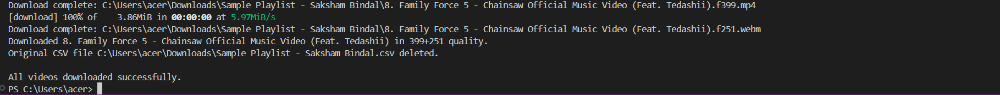

# YouTube Playlist Downloader

The **YouTube Playlist Downloader** is a Python-based tool that simplifies downloading entire YouTube playlists in a **sequential and organized manner**. Users can easily extract video URLs, process them, and download all videos in a **serializable way**, ensuring each video is downloaded individually. The tool automatically saves each video with a **serial number corresponding to its order in the playlist**, making it easy to keep track of the original sequence. It also includes robust error handling by generating an Excel file highlighting undownloaded videos, making it easy to identify and reattempt any failed downloads. This project is designed to provide a seamless and automated experience for managing YouTube playlists efficiently.

## Features  

- Downloads videos from YouTube playlists in a **sequential order**.  
- Saves videos with a **serial number corresponding to their position in the playlist**. 
- Creates a folder with the **same name as the CSV file** where all the downloaded videos are stored. 
- Robust **retry mechanism** to handle download errors effectively.  
- Supports videos with resolutions up to **1080p**, ensuring high-quality downloads.
- After downloading all the videos, the terminal will display a message indicating whether all videos were downloaded successfully.
- If any videos fail to download, the terminal will list them. Moreover, these videos will be highlighted in red in the generated Excel file for easy identification.

## Prerequisites  

Before using the **YouTube Playlist Downloader**, ensure the following:  

- Install the required extension, [YouTube URL Extractor](https://chromewebstore.google.com/detail/youtube-url-extractor/jmilibpbdpajjnabchfpfmmmjgbimefo) by Coral Labs, from the Chrome Web Store.  
- **Python 3.7+** is installed on your system.
- Install the required dependencies by running the following command in your terminal:
  ```bash
  pip install -r requirements.txt
  ```
- Ensure the YouTube playlist to be downloaded is public (if it's self-made).

## Usage  

To use the **YouTube Playlist Downloader**, follow these steps:

1. **Open the YouTube playlist**:
   - If you're using a self-made playlist, ensure it is set to **public**.
   
2. **Extract URLs using the extension**:
   - Click on the **YouTube URL Extractor** extension in your browser while on the playlist webpage.
   - Click the **Extract URLs** button and verify the extracted URLs in the extension.
   
3. **Export the CSV**:
   - Once everything looks fine, click on the **Export CSV** button to download a file named `youtube_videos.csv`.
   
4. **Rename the CSV file**:
   - Go to the folder where the CSV file was downloaded and rename it to whatever you wish the folder (where the videos will be downloaded) to be named.  
   - For example, rename `youtube_videos.csv` to `Youtube_playlist.csv` (this will be the name of the folder where the videos will be saved).
   
5. **Copy the file path**:
   - Right-click on the renamed CSV file and select **Copy as path**. This will copy the file path to your clipboard.
   
6. **Run the Python script**:
   - Run the provided Python script in your terminal or command prompt. When prompted, paste the copied file path from the previous step.
   
7. **Download begins**:
   - The script will begin downloading the playlist videos **sequentially** (serializable way), starting from the first video in the playlist. A new folder with the same name as the CSV file will be created in the same location as the CSV file.
   - Each video will be saved with a serial number in front of its name according to the order in the playlist.

After the download is complete, the CSV file will be automatically deleted, and an **Excel file** will be created in its place, containing a list of all the videos with the ones that failed to download highlighted in **red**.

## Error Handling  

The **YouTube Playlist Downloader** is designed to handle errors gracefully. Here's how the script manages errors:

1. **Retry Mechanism**:
   - If the download of a video fails, the script will automatically retry up to 3 times before giving up. This ensures that intermittent network issues or temporary YouTube errors don't stop the process.

2. **Failed Downloads**:
   - If a video cannot be downloaded after all retries, the video will be marked as failed in the output Excel file. The failed videos will be highlighted in **red** to make them easy to identify.
   
3. **Skipped Videos**:
   - If a video already exists in the destination folder (based on its name and format), the script will skip downloading it and move on to the next video.
   
4. **Unexpected Errors**:
   - In case of unexpected issues, such as permission problems or file path errors, the script will display an error message and terminate the process, providing the user with helpful feedback on what went wrong.

5. **File Overwrite Protection**:
   - The script ensures that videos are not overwritten if they already exist in the destination folder. It skips any video that is already downloaded, preventing unnecessary re-downloads.

## Screenshots

### Step 1: Download the Extension  
   Screenshot showing the **YouTube URL Extractor** extension page on the Chrome Web Store.  
   [Extension Link](https://chromewebstore.google.com/detail/youtube-url-extractor/jmilibpbdpajjnabchfpfmmmjgbimefo)
   
     

### Step 2: Extracting URLs using the YouTube URL Extractor Extension and Export the CSV File 
   Screenshots showing the YouTube Playlist page and the **YouTube URL Extractor** extension with the 'Extract URLs' and 'Export CSV' buttons. 

     
   
     
   
     
   
     

### Step 3: Renaming the CSV File  
   Screenshot showing the downloaded CSV file, renamed to `Sample Playlist - Saksham Bindal.csv` (or any name you prefer for the folder where videos will be downloaded).  

   

### Step 4: Opening the CSV File
   Screenshot showing the downloaded CSV file.

   

### Step 5: Copying the path of a file
   Screenshot showing the **Copy as path** option in the right-click menu.

   

### Step 6: Running the Python Script  
   Screenshot showing the terminal window where the user is prompted to paste the CSV file path.

   

   

### Step 7: Download Process in Progress  
   Screenshot of the download process running in the terminal, showing the progress of each video being downloaded sequentially.

   
   
   

### Step 8: Final Excel Report  
   Screenshot of the final Excel report generated, with all downloaded videos listed and failed videos highlighted in red.

   
   
   

### Step 9: Downloaded videos folder 
   Screenshot of the final downloaded videos folder with the names of the videos downloaded with a serial number.

   
